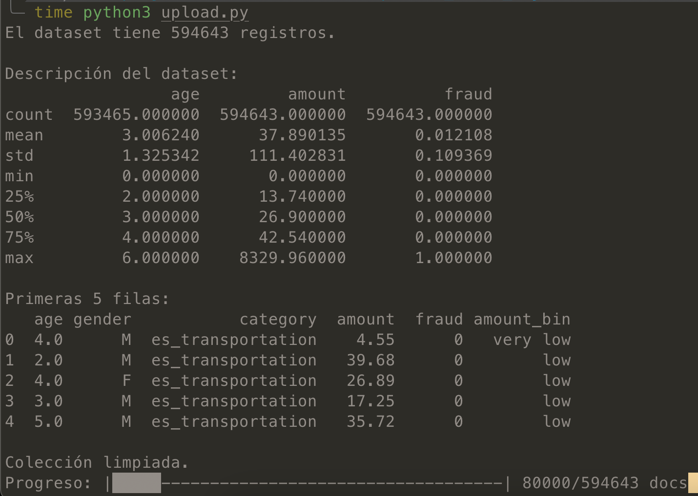
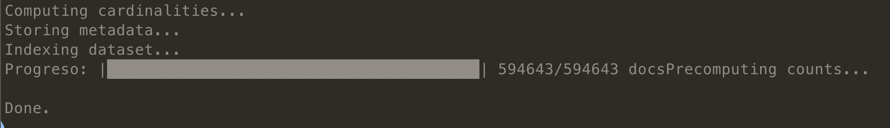
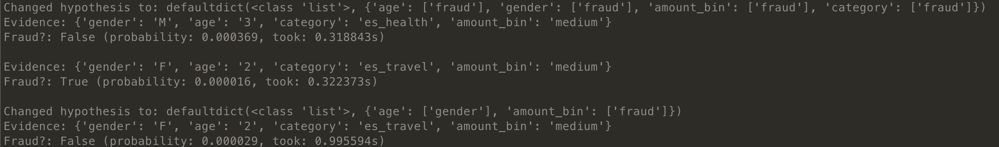
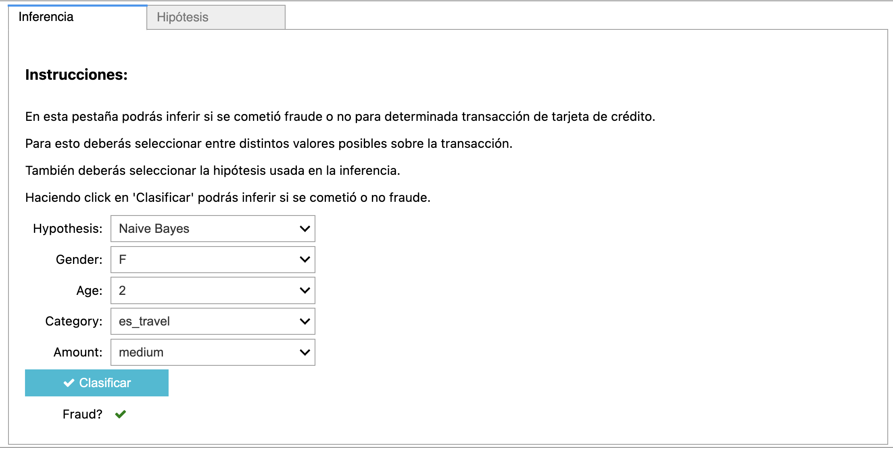
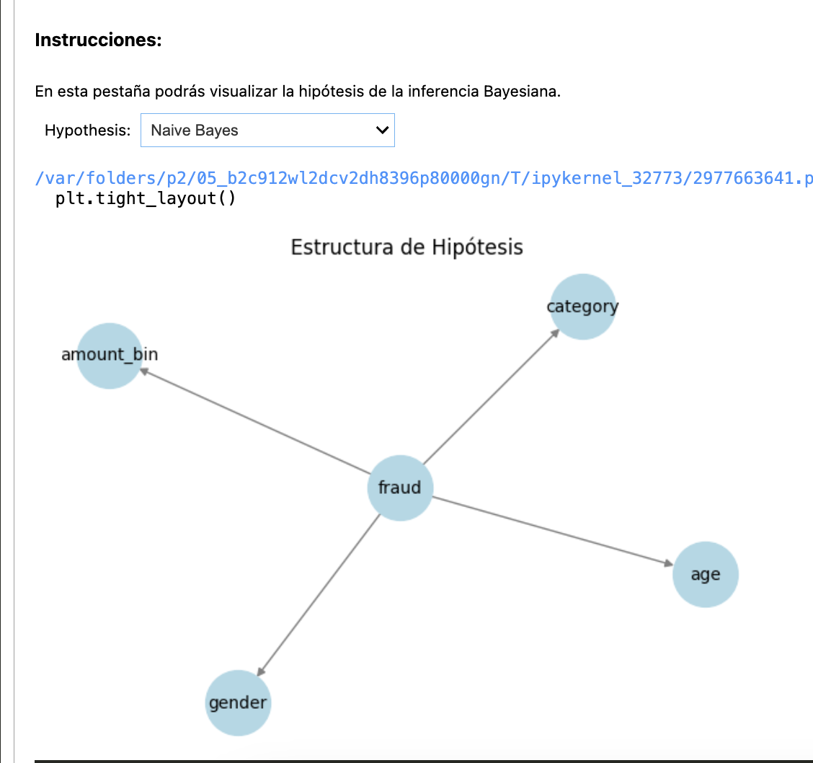

# [PUCP] NoSQL - Bayesian Network Classifier

## GitHub

https://github.com/daneelsan/PUCP_NoSQL_BayesianClassifier/tree/main

NOTE: El repositorio esta Private.

## Dependencies

-   python-dotenv
-   pandas
-   pymongo
-   ipywidgets
-   networkx
-   matplotlib

## Report

El [reporte](./BBDD_Estructuradas.pdf) contiene detalles de este proyecto.

## Project Structure

```
- fraud_credit_card.zip // The compressed data. Unzip this before working running upload.py
- upload_dataset.py             // Module in charge of uploading the .csv into MongoDB
- index_dataset.py      // Module in charge of indexing the dataset and storing metadata into MongoDB
- interface.ipynb       // Module in charge of presenting an interface of the classifier to the user
- bayes_classifier.py           // Module in charge of classifing using Bayesian Networks and the MongoDB database
- test_classifier.py           // Test file for bayes_classifier.py
- learn_k2_structures.py       // Compute the best k2 structures and store them in learned_hypotheses.json
- full_benchmark_classifier.py   // Do benchmarks for each hypothesis and store them in full_benchmark_results.csv
- classification_metrics.py     // Run benchmarks for classification metrics
- .env                  // File containing environment settings
```

## .env

The `ATLASMONGODB_CONNECTION_STRING` variable is set in [.env](./.env).
To modify the connection string, simply change the contents of this file.

## Upload dataset to MongoDB

```shell
$ time python3 upload_dataset.py
```



## Index dataset and metadata to MongoDB

```shell
$ python3 index_dataset.py
```



## Test `bayes_classifier.py`

```shell
$ python3 test_classifier.py
```



## Benchmarking

Run benchmarks for different optimization levels:
```shell
$ python3 benchmark_classifier.py indexes_precompute_cache
Using output filename: benchmarks/benchmark_results-indexes_precompute_cache.csv
Test 0-0: 0.1965s
Test 0-1: 0.0001s
Test 0-2: 0.0001s
Test 0-3: 0.0001s
Test 0-4: 0.0001s
Test 0-5: 0.0000s
Test 0-6: 0.0000s
Test 0-7: 0.0000s
Test 0-8: 0.0000s
Test 0-9: 0.0000s
Test 1-0: 0.1597s
Test 1-1: 0.0001s
Test 1-2: 0.0000s
Test 1-3: 0.0000s
Test 1-4: 0.0000s
Test 1-5: 0.0000s
Test 1-6: 0.0000s
Test 1-7: 0.0000s
Test 1-8: 0.0000s
Test 1-9: 0.0000s
```

Run benchmarks for different hypotheses:
```shell
$ python3 full_benchmark_classifier.py
Testing hypothesis: Naive Bayes
   Evidence 1: average time = 0.3803s
   Evidence 2: average time = 0.4760s
   Evidence 3: average time = 0.4080s
   Evidence 4: average time = 0.3584s
   Evidence 5: average time = 0.3625s
   Evidence 6: average time = 0.3552s
   Evidence 7: average time = 0.3611s
   Evidence 8: average time = 0.3576s
   Evidence 9: average time = 0.3556s
   Evidence 10: average time = 0.3623s
   Evidence 11: average time = 0.3647s
   Evidence 12: average time = 0.3574s
   Evidence 13: average time = 0.3633s
   Evidence 14: average time = 0.3570s
   Evidence 15: average time = 0.3571s
   Evidence 16: average time = 0.3619s
   Evidence 17: average time = 0.3701s
   Evidence 18: average time = 0.3539s
   Evidence 19: average time = 0.3630s
   Evidence 20: average time = 0.3548s

Testing hypothesis: Fraud as Root Cause
   Evidence 1: average time = 0.5750s
   Evidence 2: average time = 0.5684s
   Evidence 3: average time = 0.4400s
   Evidence 4: average time = 0.5973s
   Evidence 5: average time = 0.4373s
   Evidence 6: average time = 2.4535s
   Evidence 7: average time = 0.4504s
   Evidence 8: average time = 0.5119s
   Evidence 9: average time = 0.4729s
   Evidence 10: average time = 0.4377s
   Evidence 11: average time = 0.4526s
   Evidence 12: average time = 2.5094s
   Evidence 13: average time = 1.0164s
   Evidence 14: average time = 0.6970s
   Evidence 15: average time = 0.6900s
   Evidence 16: average time = 0.6968s
   Evidence 17: average time = 0.5941s
   Evidence 18: average time = 2.3440s
   Evidence 19: average time = 0.4654s
   Evidence 20: average time = 0.4599s
```

Run benchmarks for different dataset sizes:
```shell
$ python3 fraction_benchmark_classifier.py
Test 0-0: 0.3183s
Test 0-1: 0.3162s
Test 0-2: 0.3182s
Test 0-3: 0.3183s
Test 0-4: 0.3240s
Test 0-5: 0.3186s
Test 0-6: 0.3241s
Test 0-7: 0.3205s
Test 0-8: 0.3198s
Test 0-9: 0.3165s
Test 1-0: 0.3183s
Test 1-1: 0.3163s
Test 1-2: 0.3208s
Test 1-3: 0.4564s
Test 1-4: 0.3229s
Test 1-5: 0.3214s
Test 1-6: 0.3186s
Test 1-7: 0.3162s
Test 1-8: 0.3337s
Test 1-9: 0.3180s
```

## K2 structure learning algorithm

```shell
K2 Structure Learning Script
========================================
Initializing Bayesian Classifier (alpha=0.5)...
Changed hypothesis to: defaultdict(<class 'list'>, {'age': ['fraud'], 'gender': ['fraud'], 'amount_bin': ['fraud'], 'category': ['fraud']})
Alpa: 0.5
Dataset size: 594,643 documents
Variables: ['age', 'gender', 'category', 'amount_bin', 'fraud']
Variable cardinalities: [('age', 8), ('gender', 4), ('category', 15), ('amount_bin', 4), ('fraud', 2)]

============================================================
Learning K2 structure for u=1 (max 1 parents per variable)
============================================================
Variable order: ['age', 'gender', 'amount_bin', 'category', 'fraud']

Learning parents for age...
  No possible parents (first variable)

Learning parents for gender...
  Score with no parents: -325324.4340
  Score with parents ['age']: -411880.0739
  No improvement found, stopping
  Final parents for gender: []

Learning parents for amount_bin...
  Score with no parents: -484545.5499
  Score with parents ['age']: -580303.2697
  Score with parents ['gender']: -580180.7936
  No improvement found, stopping
  Final parents for amount_bin: []

Learning parents for category...
  Score with no parents: -343073.0729
  Score with parents ['age']: -439031.1119
  Score with parents ['gender']: -438769.3490
  Score with parents ['amount_bin']: -371909.4661
  No improvement found, stopping
  Final parents for category: []

Learning parents for fraud...
  Score with no parents: 56742.3538
  Score with parents ['age']: -38957.2596
  Score with parents ['gender']: -38752.1785
  Score with parents ['amount_bin']: -20330.3174
  Score with parents ['category']: -16960.1308
  No improvement found, stopping
  Final parents for fraud: []
Best hypothesis for u=1: {'age': [], 'gender': [], 'amount_bin': [], 'category': [], 'fraud': []}
Converted hypothesis: {}
Learning completed in 115.69 seconds
Structure learned: K2 learned (u=1)
Parent-child relationships:
  Child → Parents:
    age ← (no parents)
    gender ← (no parents)
    amount_bin ← (no parents)
    category ← (no parents)
    fraud ← (no parents)
  Parent → Children:
  Statistics:
    Total edges: 0
    Max parents for any variable: 0
    Variables with parents: 0/5

============================================================
Learning K2 structure for u=2 (max 2 parents per variable)
============================================================
Variable order: ['age', 'gender', 'amount_bin', 'category', 'fraud']

Learning parents for age...
  No possible parents (first variable)
```

## Classification Metrics

```shell
$ python3 classification_metrics.py
Iniciando la evaluación del Clasificador Naive Bayes en el dataset completo...

--- Clasificador Naive Bayes en dataset completo (594,643 documentos) ---
  Obteniendo 100 muestras de prueba para evaluación...
  Clasificando 100 muestras...

--- Resultados de la Clasificación (Naive Bayes) ---
  Muestras clasificadas: 100
  Tiempo promedio por clasificación: 0.008636 segundos
  ------------------------------------------------
  **Accuracy (Exactitud):** 0.9900 (Proporción de predicciones correctas)
  **Precision (Precisión):** 1.0000 (De los predichos como fraude, ¿cuántos eran realmente fraude?)
  **Recall (Exhaustividad):** 0.5000 (De todos los fraudes reales, ¿cuántos fueron detectados?)
  **F1-Score:** 0.6667 (Media armónica de Precision y Recall)
  ------------------------------------------------

Resultados guardados en 'naive_bayes_metrics.json'
```

## Interface

Simply run the `interface.ipynb` in VScode.




