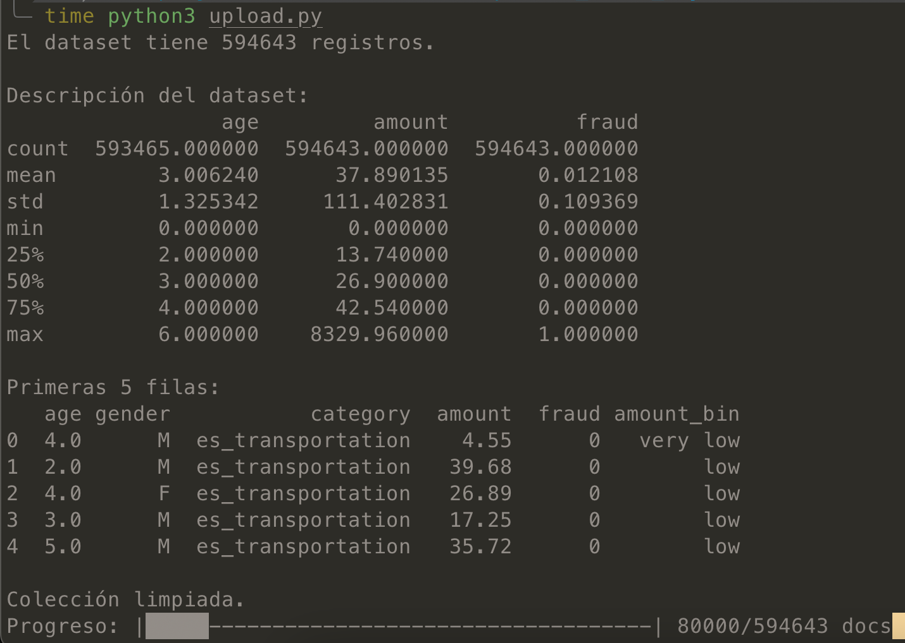
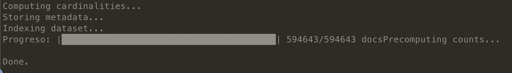
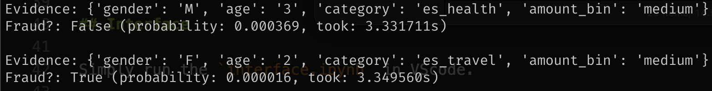
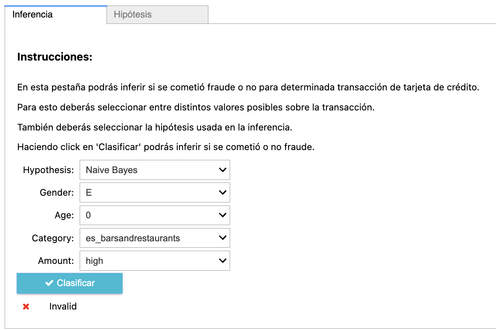
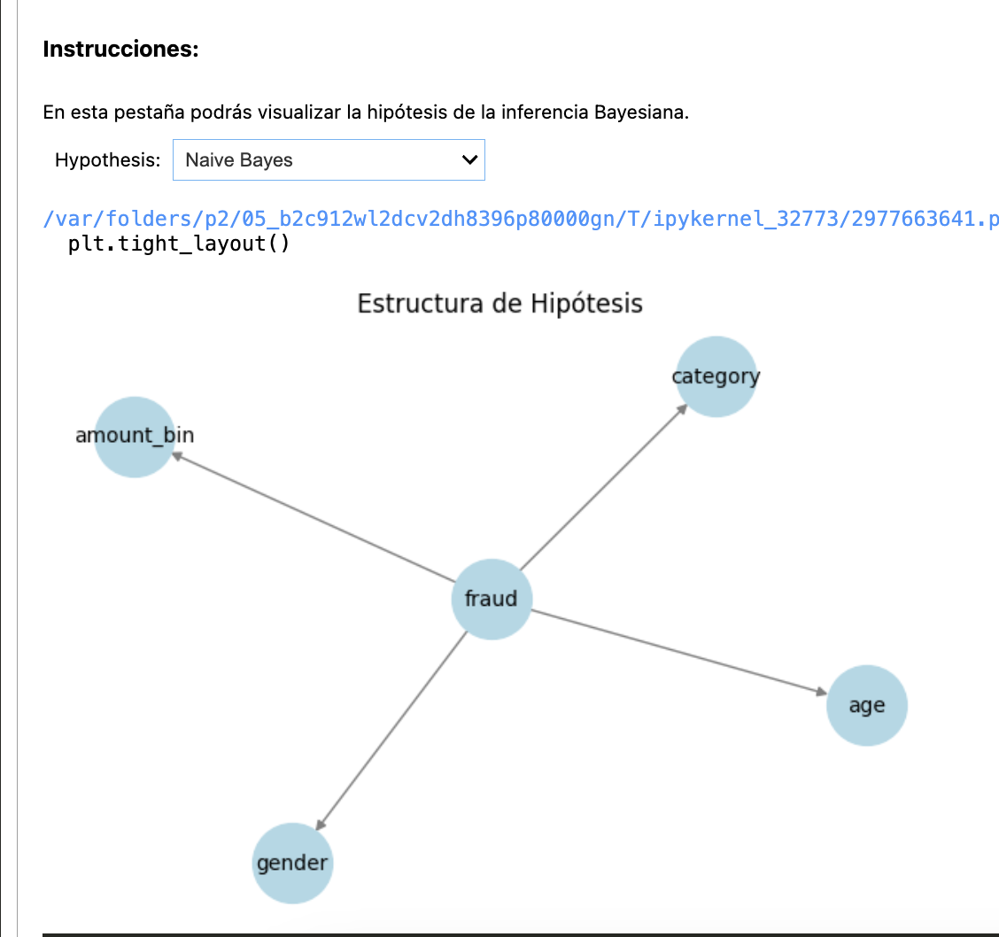

# [PUCP] NoSQL - Bayesian Network Classifier

## GitHub

https://github.com/daneelsan/PUCP_NoSQL_BayesianClassifier/tree/main

NOTE: El repositorio esta Private.

## Integrantes

- Javier Monzon (20121248, javier.monzon@pucp.edu.pe)
- Daniel Sanchez (20130495, hdsanchez@pucp.edu.pe)

## Dependencies

-   python-dotenv
-   pandas
-   pymongo
-   ipywidgets
-   networkx
-   matplotlib

## Report

El [reporte](./BBDD_Estructuradas.pdf) contiene detalles de este proyecto.

## Project Structure

```
- fraud_credit_card.zip // The compressed data. Unzip this before working running upload.py
- upload_dataset.py             // Module in charge of uploading the .csv into MongoDB
- index_dataset.py      // Module in charge of indexing the dataset and storing metadata into MongoDB
- interface.ipynb       // Module in charge of presenting an interface of the classifier to the user
- bayes_classifier.py           // Module in charge of classifing using Bayesian Networks and the MongoDB database
- test_classifier.py           // Test file for bayes_classifier.py
- .env                  // File containing environment settings
```

## .env

The `ATLASMONGODB_CONNECTION_STRING` variable is set in [.env](./.env).
To modify the connection string, simply change the contents of this file.

## Upload dataset to MongoDB

```python
$ time python3 upload_dataset.py
```



## Index dataset and metadata to MongoDB

```python
$ python3 index_dataset.py
```



## Test `bayes_classifier.py`

```python
$ python3 test_classifier.py
```



## Interface

Simply run the `interface.ipynb` in VScode.




